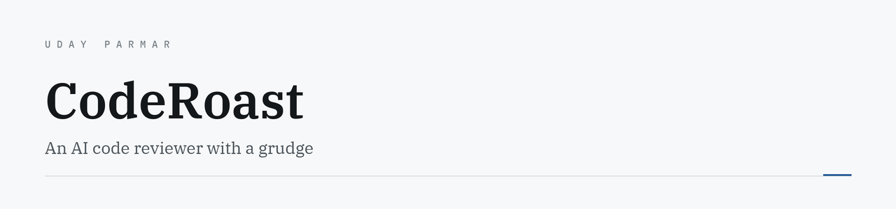

<picture>
  <source media="(prefers-color-scheme: dark)" srcset="assets/banner-dark.png">
  <source media="(prefers-color-scheme: light)" srcset="assets/banner-light.png">
  
</picture>

<p>
  <a href="https://marketplace.visualstudio.com/items?itemName=accidental-mvp.code-roast"></a>
  
  
  <a href="https://uday-parmar.vercel.app/work/coderoast"></a>
</p>

Reads your code, silently judges your life choices, and roasts every bad line.

> It doesn't ask *"are you ready for feedback?"*
> It asks *"are you emotionally stable enough to handle this?"*

---

## The serious version

Linters catch syntax and miss judgment. Review tools that *do* catch judgment produce polite
reports nobody opens. The analysis is rarely what fails — **the delivery is**.

So CodeRoast reports through the editor's own **Diagnostics API**, the same channel a real
linter uses. Findings appear squiggled under the offending line, in the Problems panel, where
you are already looking — not in a separate report you will close.

The humour is the delivery mechanism. I act on considerably more of this feedback than I ever
did on a clean report, which was the entire hypothesis.

## What it looks at

Logic flaws · naming crimes · empty `catch` blocks · missing error handling · style · things
that would make your senior dev sigh audibly.

```ts
if (data == null || data == undefined) {
```
> *Congratulations on checking for null twice and undefined zero times. `==` already did this
> for you. You wrote extra characters to achieve nothing.*

## Output

Inline diagnostics, plus a `roast-summary.md` written to `.code-roast/database/` with severity
counts, recurring habits and suggested improvements — so the output is auditable afterwards
rather than just momentary.

## Setup

Bring your own Gemini key. No code is routed through any server of mine.

**Settings → Extensions → CodeRoast**, or in `settings.json`:

```json
{ "codeRoast.geminiApiKey": "YOUR_API_KEY_HERE" }
```

No key, no roast. Gemini demands tribute.

---

<sub>Built by <a href="https://uday-parmar.vercel.app">Uday Parmar</a></sub>
